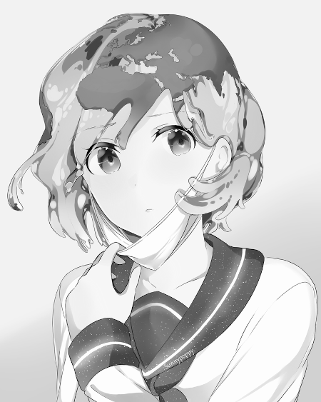
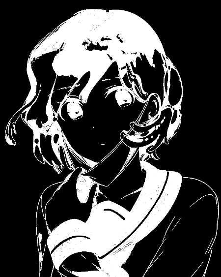

# TD-FICHIERS

Programme réponse au TD10 de Programmation C du Semestre 1 d'ING1

<https://gitlab.etude.eisti.fr/leflochtho/greyscalefromppm>

## Compilation

Compilation simple : `make all`

Pour nettoyer les .o : `make clean`

Pour supprimer tout les fichiers générables : `make mrproper`

## Execution

Pour afficher l'aide du programme il vous suffit d'entrer la commande :
`./bin/td10`

Ou voici l'aide : 

                                                ************** TRAITEMENT D'IMAGE **************    

        -in nomImage1 : précise l’image en entrée, 
        NB : si vous entrez une image sans préciser d'opération, le programme va vous charger l'image et vous la sauvegarder dans un nouveau fichier. 
        -out nomImage2 : précise l’image en sortie, si non spécifié, "output.ppm/pbm/pgm" par défaut. La prise en charge de l'extension est également automatique.
        -gris : transformation en niveau de gris 
        -seuil "valeur" : seuillage

Si vous utilisez le seuillage, le passage en niveau de gris est automatique pour toute image en couleur.

Exemple : Transformation d'une image en niveau de gris (earthchan.ppm)

`./bin/td10 -in earthchan.ppm -out earthchanb -gris`
### Exemples : 

#### ORIGNALE 
###### (convertie depuis un .png avec GIMP)

### NOIR ET BLANC 
###### (-gris)

#### SEUILLAGE 
###### (-seuil 190) : 

Vous trouverez dans le dossier "assets/" ces tests dans leurs formats respectifs (`.ppm` , `.pgm` et `.pbm`).

## Doxygen

Le fichier de configuration Doxygen (Doxyfile) est déjà généré, il suffit de taper `make doxy` 
et l'index html de la documentation s'ouvre. 

## Contribution

Auteurs : LEFLOCH Thomas <<leflochtho@eisti.eu>>